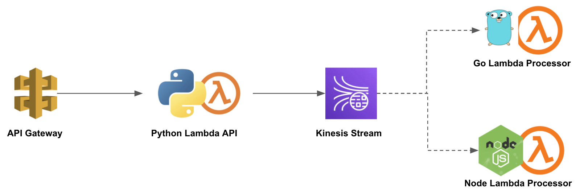

# Distributed Tracing and Logs in Context for Lambda Functions

This is a sample application that shows how to:
1. Instrument Lambda functions written in Python, Go and NodeJS
2. Propagate trace headers to enable distributed tracing
3. Enable logs in context


## Application Architecture

The application starts by invoking the Python function thru an AWS API Gateway. It then presents a form with a text field and a dropdown field. Upon submitting the form, the text message will be put as a record in a kinesis stream. Depending on the dropdown field selection, either the Go or NodeJS function will be triggered. Both functions are accomplishing the same things but vary slightly in implementation.




## Installation

### Prerequisites
1. AWS account
2. AWS CLI and SAM CLI are configured
3. New Relic account


### Deployment
Run the `deploy.sh` passing your New Relic account ID and AWS region
```
  $ ./deploy.sh xxxxxxx region
```

This will create the following:
1. Python, Go and Node Lambda functions
2. Two distinct Kinesis streams mapped as an event source for the Go and Node functions, respectively.
3. API Gateway endpoints to test/access the Python function


## Testing
Navigate to your AWS console and find the `processRecords` CloudFormation stack. In the `Outputs` tab, click the `PythonApi` link. Happy testing!


## License
Apache-2.0 © [Jo Ann de Leon](https://github.com/jospdeleon)
